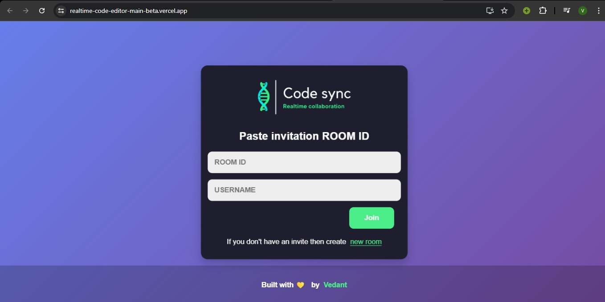
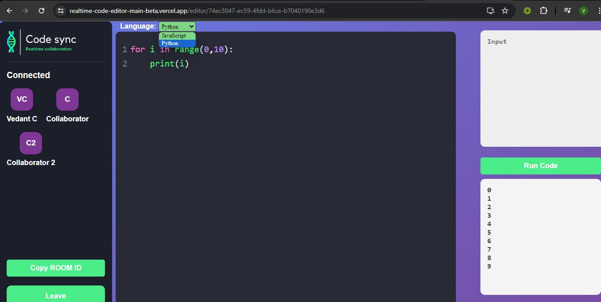

# Real-time Code Compiler

## Overview

The Online Real-time Compiler is a web application that allows users to connect using a unique room ID and collaborate on coding in real-time. The application is built using React, Node.js, Express.js, and WebSockets, and it is deployed on Vercel and Render.

## Features

- **Real-time Collaboration**: Connect with others using a unique room ID and code together in real-time.
- **React-based Frontend**: A modern, responsive interface built with React.
- **Backend with Node.js and Express.js**: A robust backend to handle the compilation and room management.
- **WebSockets for Real-time Communication**: Instant updates and collaboration using WebSockets.
- **Deployment**: Frontend deployed on Vercel and Backend deployed on Render.

## Technologies Used

- **Frontend**: React
- **Backend**: Node.js, Express.js
- **Real-time Communication**: WebSockets
- **Deployment**: Vercel (frontend), Render (backend)

## Screenshots


*Homepage of the Online Real-time Compiler.*


*Real-time collaborative code editor.*

## Getting Started

### Prerequisites

- Node.js (version 12 or higher)
- npm (version 6 or higher)

### Installation

1. Clone the repository:
    ```bash
    git clone https://github.com/your-username/online-realtime-compiler.git
    cd online-realtime-compiler
    ```

2. Install dependencies for both frontend and backend:

    ```bash
    # Install frontend dependencies
    cd client
    npm install

    # Install backend dependencies
    cd ../server
    npm install
    ```

### Running the Application Locally

1. Start the backend server:
    ```bash
    cd server
    npm start
    ```

2. Start the frontend server:
    ```bash
    cd ../client
    npm start
    ```

3. Open your browser and navigate to `http://localhost:3000` to use the application.

### Deployment

#### Frontend on Vercel

1. Sign up or log in to [Vercel](https://vercel.com/).
2. Link your GitHub repository and deploy the `client` directory.
3. Follow the instructions to deploy the frontend.

#### Backend on Render

1. Sign up or log in to [Render](https://render.com/).
2. Link your GitHub repository and deploy the `server` directory.
3. Follow the instructions to deploy the backend.

## Usage

1. Open the application in your browser.
2. Enter a unique room ID to join or create a room.
3. Start coding and collaborate in real-time with others.

## Contributing

1. Fork the repository.
2. Create a new branch (`git checkout -b feature-branch`).
3. Make your changes.
4. Commit your changes (`git commit -m 'Add new feature'`).
5. Push to the branch (`git push origin feature-branch`).
6. Create a new Pull Request.

## Contact

If you have any questions or suggestions, feel free to reach out at [vedant.chichmalkar@iitgn.ac.in](mailto:vedant.chichmalkar@iitgn.ac.in).
